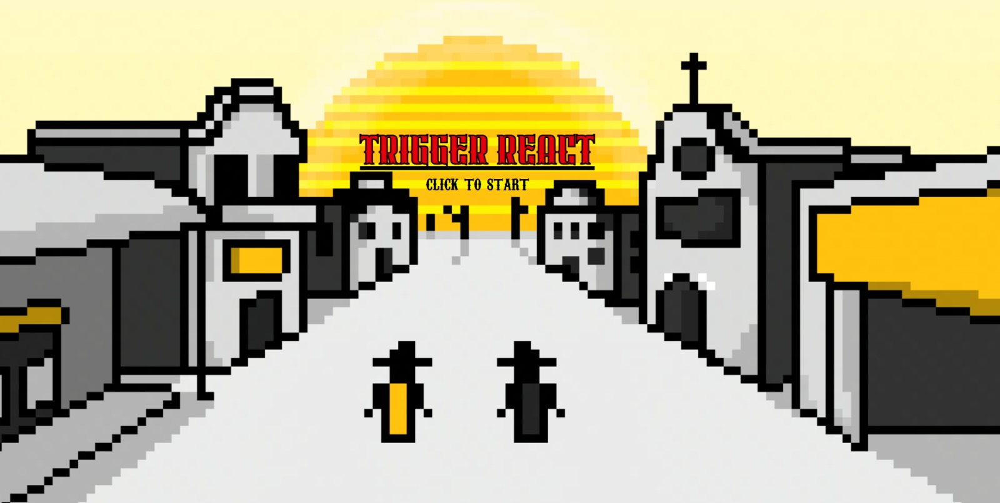

# Trigger React

Trigger React é um jogo temático de velho-oeste desenvolvido com HTML, CSS e JavaScript. Ele testa o tempo de reação do jogador em um duelo rápido e mortal.

## Sobre o jogo

O jogador participa de um duelo no estilo faroeste. Quando o sinal for dado, ele deve clicar o mais rápido possível para vencer o oponente. Caso clique cedo demais ou reaja muito devagar, perde o round.

## Pontuação

A pontuação é calculada com base no tempo de reação do jogador. Quanto mais rápido for o clique após o sinal, maior será o score obtido. A fórmula utilizada é:

